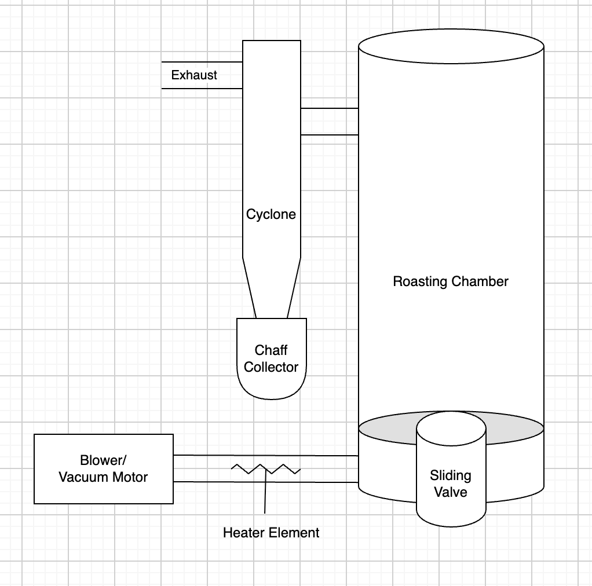

# Design Document


## 1 System Specifications

The system is a small-batch fluid-bed coffee roaster designed to roast up to 500 g of green coffee using electrically heated air. The roaster uses a vacuum blower to force air through a heating element and into the bottom of the roast chamber. The airflow provides both the heat required for roasting and the force required to circulate the coffee beans.

The design is intended to operate from a 120 VAC, 20 A electrical circuit to allow operation without requiring a 240 V supply. The system will incorporate variable heater output and variable blower speed so that heat input and bean circulation can be controlled independently throughout the roast.

An ESP32-based control system will collect temperature and process data and control the heater and blower. Initial roast monitoring and profile visualization will be performed using Artisan. A custom user interface may be developed in a later revision.


| Parameter | Specification |
|---|---|
| Maximum batch size | 500 g |
| Nominal batch size | 350–400 g |
| Electrical supply | 120 VAC / 20 A |
| Heater capacity | ~1.7–1.8 kW |
| Roast method | Fluid-bed / spouted-bed |
| Roast chamber diameter | ~100 mm ID |
| Primary nozzle diameter | 35 mm |
| Target airflow | ~25–45 CFM |
| Blower type | Vacuum |
| Main controller | ESP32 |
| Roast software | Artisan |

### 1.2 Assumption & Constraints 

- The roaster is expected to operate primarily with batches between 350 g and 500 g. Smaller batch sizes may be supported but are not the primary design target.

- The blower will remain upstream of the heater so that it handles approximately ambient-temperature air rather than heated process air.

- The complete roaster must operate within the available electrical power of the intended 120 VAC supply.

- The heater and blower will share a limited power budget. The design targets approximately 1.7–1.8 kW of installed heating capacity while minimizing blower and control-system power consumption.

- The roaster must maintain sufficient airflow whenever the heater is energized. Loss of airflow while the heater remains energized could result in excessive heater temperature and represents a significant safety condition.

- The system must also tolerate the changing physical properties of the coffee throughout the roast. Coffee beans lose mass and change density during roasting, which changes the airflow required to maintain circulation.

- The mechanical system must contain hot coffee beans and chaff while allowing exhaust air to leave the roast chamber.

### 1.3 System Environment

The roaster is intended to operate as a standalone electrical appliance in a well-ventilated environment appropriate for coffee roasting.

The primary electrical input is 120 VAC. Lower-voltage DC supplies may be derived internally for the ESP32, sensors, blower control, relays, and other control electronics.

A computer running Artisan may be connected to the roaster during development and normal operation. The roaster controller should ultimately be capable of maintaining basic machine operation independently of the computer.

The roaster will generate hot exhaust air, smoke, and chaff. Exhaust handling and chaff separation must therefore be incorporated into the mechanical design.

## 2 Mechanical Design

The mechanical system establishes the airflow path through the roaster and provides the structures required to contain, circulate, roast, discharge, and cool the coffee beans.


### 2.1 Component Diagram


**Components**
- Centrifugal blower
- Heater housing
- Air plenum
- Air nozzle
- Roast chamber
- Expansion chamber
- Chaff separator
- Bean discharge mechanism
- Cooling system
- Structural frame

### 2.2 Theory of Operation
The centrifugal blower supplies the pressure and airflow required to circulate the beans.

The blower is positioned before the heater so that the blower operates with relatively cool inlet air. The heater raises the temperature of the process air before it enters the plenum.

The plenum provides a transition between the heater outlet and the smaller air nozzle while providing a location for process-air temperature and pressure measurements.


## 3 Electrical Design

The electrical system supplies power to the heater, blower, control electronics, sensors, and safety devices. The design assumes a 120VAC/20A supply.


### 3.1 Component Diagram

### 3.2 Heater Power
The heating system will provide approximately 1.7–1.8 kW of maximum installed heating capacity.

Heater output will be electronically adjustable to allow the controller to vary heat input during the roast.

A solid-state switching device or suitable power controller will provide heater modulation.

The heater control system must be designed so that normal software control is separate from hardware safety functions.

### 3.3 Blower Power
A variable-speed centrifugal blower will provide process airflow.

The current design target is approximately 25–45 CFM, but the final airflow and static-pressure requirements will be determined experimentally.

The preferred final blower will support electronic speed control, allowing blower output to be adjusted independently from heater output.


## 4 Software/Controls Design
The control system is responsible for sensor acquisition, heater commands, blower commands, process monitoring, data communication, and eventually automated roast control. The system will be built around an ESP32 controller.


### 4.1 Component Diagram

### 4.2 Sensors
Initial instrumentation is expected to include:

| Sensor | Measurement |
|---|---|
| Bean thermocouple | Bean/environment temperature |
| Inlet thermocouple | Heated process-air temperature |
| Exhaust thermocouple | Exhaust temperature |
| Pressure sensor | Roast chamber / bed pressure |
| Airflow measurement | Development and characterization |


### 4.3 Heater and Airflow Control
Heater output and airflow will be independently adjustable.

The two primary process commands will be:

```text
HEAT    0–100%
AIR     0–100%
```

This allows airflow to be adjusted as bean density and circulation behavior change throughout the roast without requiring an equivalent change in heater output.

Future versions may automatically manipulate these variables to follow a target roast profile or Rate of Rise.

### 4.3 Artisan Integration
The initial software interface will use Artisan for roast visualization and data logging.

The ESP32 will provide temperature and operating data to Artisan while receiving or executing heater and blower commands as required.

Artisan will initially provide:

- Roast graphs
- Bean temperature
- Rate of Rise
- Event tracking
- Roast timing
- Profile comparison
- Data logging

Using an existing roast-monitoring application allows development effort to remain focused on the physical roaster and embedded controls during the early prototype stages.